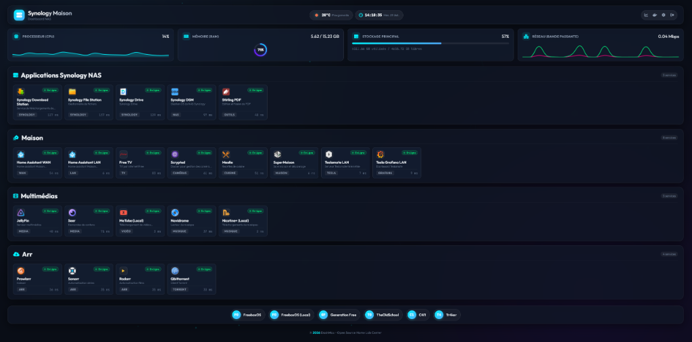

# 🚀 DashMax - Ultra-Modern Synology Home Lab Dashboard & Container Manager

**DashMax** est un tableau de bord Home Lab ultra-moderne, rapide et esthétique conçu spécialement pour les NAS Synology, serveurs Docker et passionnés de Domotique / Self-Hosting.



---

## ✨ Fonctionnalités Clés

- **⚡ Relevés Système en Temps Réel** : Suivi en direct de l'utilisation du processeur (CPU), de la mémoire (RAM) et des cartes réseau.
- **🐳 Gestionnaire Docker Socket Direct** :
  - Liste interactive de tous les conteneurs Docker (En cours, Arrêtés).
  - Contrôle d'exécution : **Démarrer**, **Arrêter** et **Redémarrer**.
  - **Consommation RAM en temps réel** par conteneur.
  - **Visionneuse de Logs en direct** avec fonction de copie et recherche.
- **📂 Gestion des Projets Synology Container Manager** :
  - Détection automatique des stacks Docker Compose (`com.docker.compose.project`).
  - Actions globales par projet (Démarrer / Arrêter / Redémarrer toute une stack en 1 clic).
- **📱 PWA & Optimisation iOS (iPhone / iPad)** :
  - Mode "Sur l'écran d'accueil" avec icône HD néon sans bordure blanche.
  - Prise en charge native des encoches et de la **Dynamic Island** (`env(safe-area-inset-top)`).
- **🎨 Design Cyber Neon Dark Glassmorphic** :
  - Interface futuriste avec effets de verre, dégradés vibrants et boutons tactiles réactifs.
- **🔒 Authentification Sécurisée** :
  - Protection par mot de passe et gestion des sessions.

---

## 🛠️ Déploiement Rapide avec Docker Compose

1. **Cloner le dépôt GitHub** :
   ```bash
   git clone https://github.com/maaxleop/dashmax.git
   cd dashmax
   ```

2. **Créer le fichier de configuration** :
   ```bash
   cp config.json.example config.json
   ```

3. **Lancer le conteneur Docker** :
   ```bash
   docker compose up -d
   ```

4. Accédez au tableau de bord via : **`http://<IP-VOTRE-NAS>:3550`**

---

## ⚙️ Variables d'Environnement

| Variable | Description | Valeur par défaut |
| :--- | :--- | :--- |
| `PORT` | Port d'écoute du serveur web | `3550` |
| `SECRET_KEY` | Clé secrète pour le chiffrement des sessions Flask | `dashmax-key` |
| `FLASK_DEBUG` | Mode débogage Flask | `0` |

---

## 📜 Licence

Distribué sous la licence **MIT**. Consultez le fichier [`LICENSE`](LICENSE) pour plus de détails.
